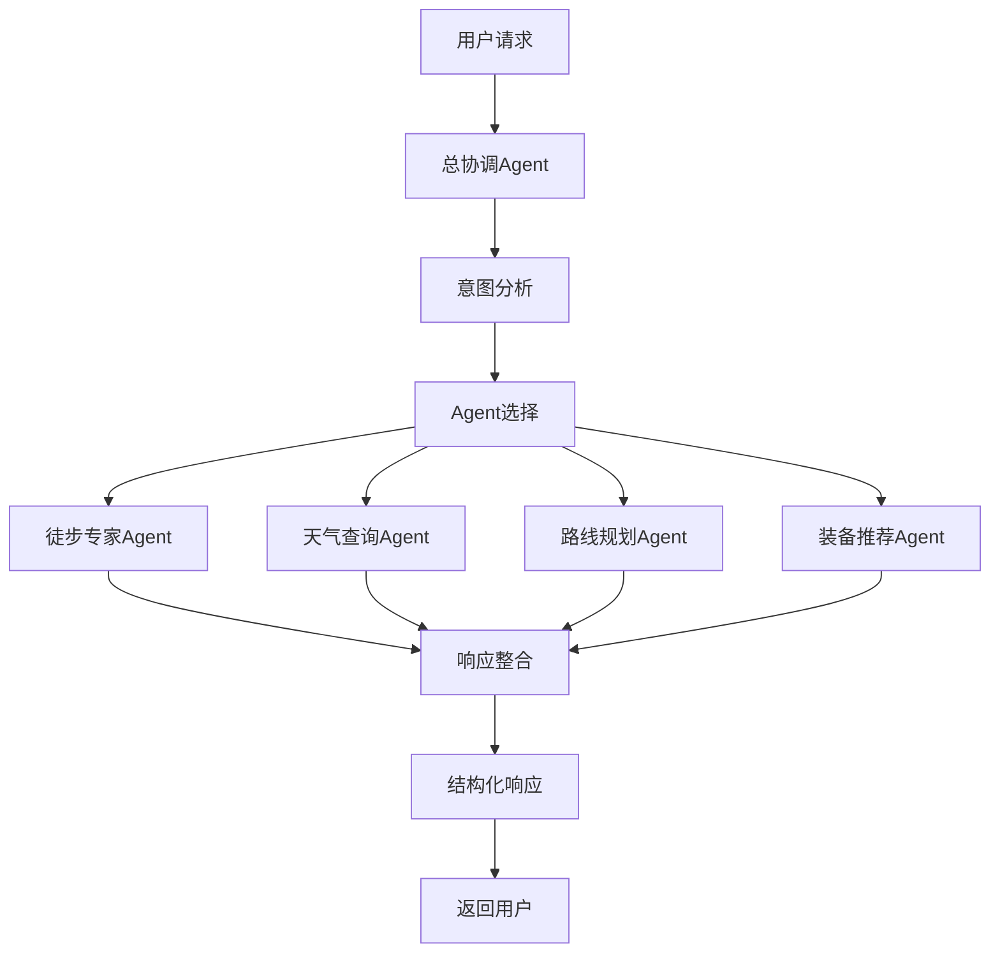
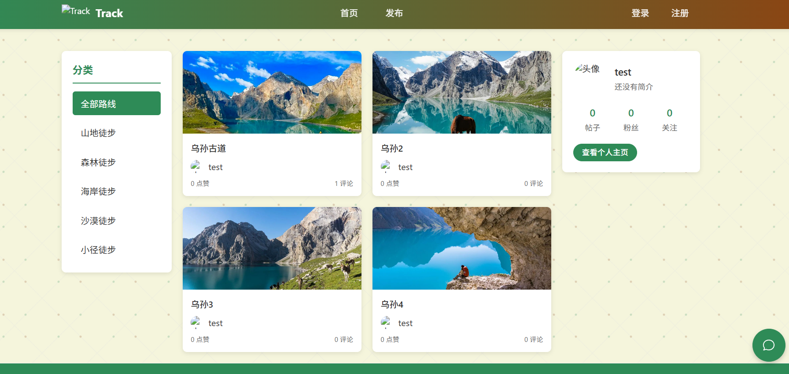
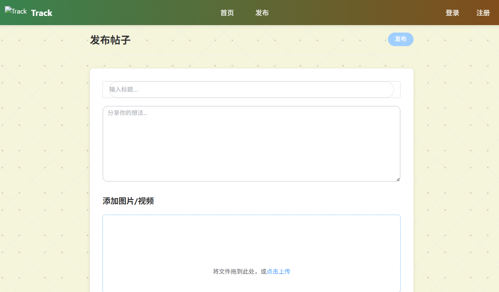

# Track-System

Track-System 是一个徒步路线分享平台，同时具备基于多Agent架构的AI助手系统，为徒步旅行爱好者提供分享和推荐服务。

## 🏗️ 多智能体架构

## 🚀 功能模块

### 1. 路线帖子
包括帖子的发布、评论、点赞、收藏等功能，可以实现基于关键词的检索。

### 2. 多agent系统
具备用户意图分析与多agent协同功能

## 🖼️ 界面展示

### 首页

### 对话界面

### 发布页面
